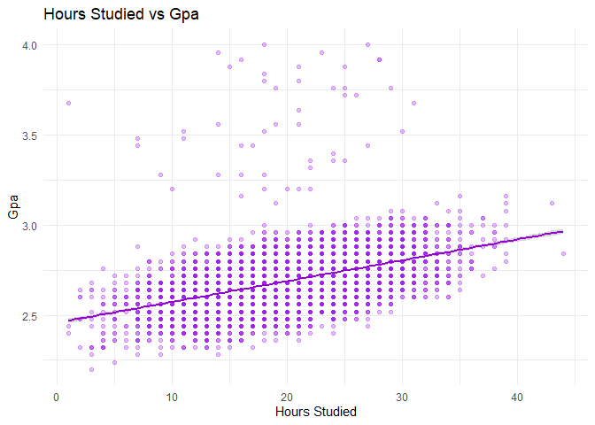

<!-- README.md is generated from README.Rmd. Please edit that file -->

# CollegeMetricsR

<!-- badges: start -->

<!-- badges: end -->

**CollegeMetricsR** is an R package designed to analyze and visualize
the relationship between student lifestyle habits and academic
performance. The package focuses on key factors such as study time,
sleep, attendance, and extracurricular involvement, and provides tools
to explore how these variables relate to outcomes like exam scores and
GPA.

College students often balance multiple responsibilities, and it can be
difficult to understand how these factors interact. This package
simplifies that process by offering intuitive functions for
summarization, visualization, correlation analysis, and performance
evaluation.

While there are datasets on student life, there are a limited number of
beginner-friendly tools that:

- Structure student lifestyle data

- Analyze relationships between variables

- Help students predict & improve their performance

**CollegeMetricsR** aims to fill in this gap by providing a
comprehensive set of functions that will help analyze student lifestyle
factors.

## Installation

You can install the development version of CollegeMetricsR from
[GitHub](https://github.com/) with:

``` r
# install.packages("pak")
pak::pak("anikavb/CollegeMetricsR")
```

``` r
library(CollegeMetricsR)
```

All required dependencies (such as `ggplot2`) are automatically
installed when installing the package.

## Data Set

<https://www.kaggle.com/datasets/lainguyn123/student-performance-factors/code>

The package utilizes a real-world dataset from Kaggle containing student
performance factors, including study habits, sleep patterns, and
external influences.

This dataset includes both numerical and categorical variables, such as
hours studied, sleep

duration, parental involvement, and exam scores. Within the package, the
data will be cleaned and transformed as needed to facilitate analysis of
relationships between lifestyle factors and academic performance.

## Functionality

This package enables users to:

- Explore student performance data

- Examine relationships between lifestyle variables and academic
  outcomes

- Summarize key patterns in student data

- Visualize trends related to student performance across metrics

- Estimate academic performance based on personal habits

The package incorporates the following functions:

### Data Preparation

- `load_student_data()` Loads and cleans the student dataset included in
  the package.

- `scale_exam_score()` Converts exam scores into a GPA-like scale for
  easier interpretation.

### Summary & Exploration

- `lifestyle_summary()` Provides summary statistics (mean, median, sd,
  etc.) for key student variables.

- `sleep_summary()` Summarizes sleep patterns across students.

- `grade_analysis()` Explores GPA/grade distribution across students.

- `student_correlation()` Calculates the correlation between any two
  numeric variables and provides a simple interpretation.

### Visualization

- `plot_relationship()` Creates scatterplots between any two variables
  with a regression trend line.

- `plot_study_vs_gpa()` Visualizes the relationship between study time
  and GPA.

- `plot_sleep_vs_gpa()` Visualizes how sleep patterns relate to GPA.

### Performance Insights

- `performance_score()` Generates a composite performance score based on
  GPA, study time, sleep, attendance, and extracurricular involvement.
  Also provides suggestions for improvement.

- `predict_gpa()` Predicts a student’s GPA based on lifestyle inputs
  using a linear model.

- `top_performers()` Identifies the top students based on a selected
  metric (e.g., exam score or GPA)

## Example Workflow

``` r

# Load and prepare data
df <- load_student_data()
df <- scale_exam_score(df)

# Summarize key variables
lifestyle_summary(df)
#>        variable  mean median   sd  min max n_missing
#> 1 Hours_Studied 19.98  20.00 5.99  1.0  44         0
#> 2   Sleep_Hours  7.03   7.00 1.47  4.0  10         0
#> 3    Exam_Score 67.24  67.00 3.89 55.0 100         0
#> 4           gpa  2.69   2.68 0.16  2.2   4         0

# Visualize relationships
plot_relationship(df, "Hours_Studied", "gpa")
#> `geom_smooth()` using formula = 'y ~ x'
```



``` r

# Analyze correlation
student_correlation(df, "Sleep_Hours", "Hours_Studied")
#> Calculating correlation between Sleep_Hours and Hours_Studied...
#> $correlation
#> [1] 0.01
#> 
#> $interpretation
#> [1] "little to no relationship"

# Predict GPA
predict_gpa(
  hours_studied = 20,
  sleep_hours = 7,
  attendance = 85,
  previous_scores = 75,
  motivation_level = "Medium"
)
#>    1 
#> 2.73

# Compute performance score
performance_score(
  gpa = 3.5,
  hours_studied = 20,
  attendance = 90,
  sleep_hours = 7,
  extracurricular = "Yes"
)
#> Moderate performance: some areas could be improved.
#> No major improvements needed: strong overall profile.
#> [1] 76.61

# Identify top students
top_performers(df, n = 5, metric = "gpa")
#>   rank Hours_Studied Attendance Parental_Involvement Access_to_Resources
#> 1    1            18         89                 High              Medium
#> 2    2            27         98                  Low              Medium
#> 3    3            23         83                 High                High
#> 4    4            14         90                 High                High
#> 5    5            28         90                  Low              Medium
#>   Extracurricular_Activities Sleep_Hours Previous_Scores Motivation_Level
#> 1                        Yes           4              73           Medium
#> 2                        Yes           6              93              Low
#> 3                        Yes           4              89              Low
#> 4                        Yes           8              86           Medium
#> 5                        Yes           9              91           Medium
#>   Internet_Access Tutoring_Sessions Family_Income Teacher_Quality School_Type
#> 1             Yes                 3          High          Medium     Private
#> 2              No                 5          High            High      Public
#> 3             Yes                 1        Medium          Medium      Public
#> 4             Yes                 4        Medium          Medium     Private
#> 5             Yes                 0        Medium          Medium      Public
#>   Peer_Influence Physical_Activity Learning_Disabilities
#> 1       Positive                 2                    No
#> 2       Positive                 3                    No
#> 3       Negative                 3                    No
#> 4       Negative                 2                    No
#> 5       Positive                 2                    No
#>   Parental_Education_Level Distance_from_Home Gender Exam_Score  gpa
#> 1                  College               Near Female        100 4.00
#> 2              High School           Moderate Female        100 4.00
#> 3              High School                Far   Male         99 3.96
#> 4              High School               Near Female         99 3.96
#> 5                  College           Moderate Female         98 3.92
```

## Use Cases

This package is useful for:

- Students analyzing their own academic habits and searching for ways to
  improve.

- Researchers exploring relationships between lifestyle and performance.

- Beginners learning data analysis in R Demonstrating simple statistical
  and visualization workflows.
